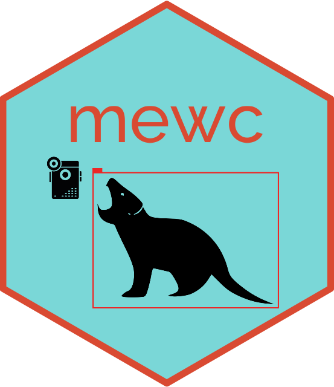

# mewc-infrastructure

This repository guides ecologists through setting up a GPU instance in ARDC Nectar Cloud using Terraform within a Docker container. This is an example of "infrastructure as code" or IAC. 

## Quick Start

1. **Clone the Repository**
Clone this repository to get started. This will include all necessary Terraform files and scripts.

```
git clone https://github.com/your-repository/mewc-infrastructure.git
cd mewc-infrastructure
```


2. **Set Up the Nectar Environment File**
Before using the Docker container, you must configure your Nectar credentials. Copy the provided `nectar.env.example` file to `nectar.env`, and fill in your details. You can find more information on how to get your Nectar credentials in the section [Setting up OpenStack Credentials](https://github.com/zaandahl/mewc-infrastructure/blob/main/README.md#setting-up-openstack-credentials).

```
cp nectar.env.example nectar.env
```


3. **Build and Launch Docker Container**
Build the Docker image and start the container using `docker-compose`. This will create an isolated environment with all the tools you need. The last command will start a Docker bash shell from which you will perform all subsequent steps.

```
docker-compose build
docker-compose up -d
docker-compose exec mewc_infra_setup bash
```


4. **Set Up a Key Pair**
Run the provided script within the Docker bash shell to generate and register a key pair with OpenStack. This key pair will be used to securely access your instances. This command will create a key pair located in the local repository you cloned under `./mewc-infrastructure/keys`. You will need to reference this key location to connect to GPU instances you create.

```
./create_keypair.sh
```

5. **Reserve a GPU Instance on ARDC Nectar**

Follow the steps in the Reserving a GPU Instance on ARDC Nectar section to ensure your analysis can leverage the power of GPU computing.

6. **Run Terraform Commands to Create the GPU Instance**
Navigate to the `gpu` folder and initialize Terraform:

```
cd gpu
terraform init
terraform apply
```


7. **Connect to the GPU Instance**
Once your instance is running, connect to it with SSH using the provided key pair. For file transfers, use an SFTP client like Cyberduck. Note that this step will typically not be performed within the Docker bash environment. You will need to reference the mewc-key.pem file generated in step 4 with your terminal or SFTP client. 

```
ssh -i path/to/mewc-key.pem ubuntu@<your-instance-ip-address>
```


8. **Teardown the GPU Instance**
When your work is complete, use Terraform's destroy command to tear down your resources and avoid incurring unnecessary charges. Use the following command in the Docker bash shell:

```
terraform destroy
```


## Detailed Information

### Setting Up OpenStack Credentials

We use environment variables to store OpenStack credentials and pass them to the Docker container. These environment variables are set in the `nectar.env` file, which is loaded when the Docker container is started.

- `nectar.env` should be set up with your OpenStack credentials. It is listed in the `.gitignore` file to prevent accidental uploading of sensitive information.

- The Docker Compose configuration file, `docker-compose.yaml`, specifies that the environment variables should be taken from the `nectar.env` file.

- These environment variables are then accessible to any processes running inside the Docker container, including the OpenStack and Terraform commands.

- They are used by the OpenStack CLI to authenticate with the OpenStack API, and by Terraform to authenticate with the OpenStack provider.

Before you can use the OpenStack client with Terraform, you'll need to set up your OpenStack credentials. These credentials are different from the login you use for the Nectar Dashboard.

Follow these steps to setup your OpenStack credentials:

- Log on to the [Nectar Dashboard](https://dashboard.rc.nectar.org.au) and ensure you're working in the right project (Use the project selector on the top left-hand side).

- Click your email address from the top right corner and click `OpenStack RC File` to download the authentication file.

- Save the authentication file to your computer. This file contains all the settings required for authentication, except for your password.

- Click `Settings` in the same drop-down menu to get to the `Settings` page. Then click `Reset Password` to generate a new OpenStack password. This password is used only when working with the CLIs and APIs. This password does not replace the password you use to log into the Dashboard.

You can read more about these steps in the [Nectar Tutorial on OpenStack Credentials](https://tutorials.rc.nectar.org.au/openstack-cli/04-credentials).

After you have your OpenStack credentials, create an `nectar.env` file in the root directory of this project and set your OpenStack environment variables there. It should look something like this:

```env
OS_AUTH_URL=http://your-openstack-url:5000/v3
OS_USERNAME=your-username
OS_PASSWORD=your-password
# ... other variables ...
```

Replace the placeholders with your actual OpenStack credentials. 


### Reserving a GPU Instance on ARDC Nectar
To reserve a GPU instance, you will need to follow these steps:

- Log on to the [Nectar Dashboard](https://dashboard.rc.nectar.org.au) and ensure you're working in the right project (Use the project selector on the top left-hand side).

- Request GPU Service by navigating under the Compute section to the Flavors area to see the available instance types. Look for flavors that include GPUs. These are typically labeled as 'gpu' in the name.

- If GPU flavors are available, you can proceed to launch an instance with the desired GPU flavor.

- If GPU flavors are not listed, you may need to request access to GPU services. This can typically be done by submitting a support ticket through the Nectar Dashboard requesting the allocation of GPU resources.

**Note:** GPU resources are in high demand and may not always be immediately available. If necessary, plan your reservations in advance and consider timeframes when GPUs are more likely to be available.


### Additional Terraform Configurations

- For setting up complex GPU instances, see the `gpu-multipleuser` folder.
- For RStudio server instances, check the `cpu-rstudio` folder.


### Listing Available Images and Flavors in OpenStack

You can list available images and flavors using the OpenStack CLI:

- To list images, use the following command:
```
openstack image list
```

- To list flavors, use:
```
openstack flavor list
```


